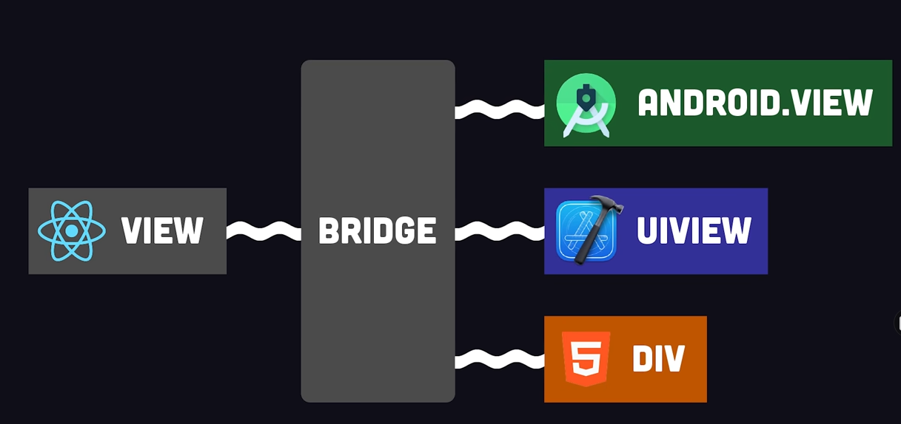
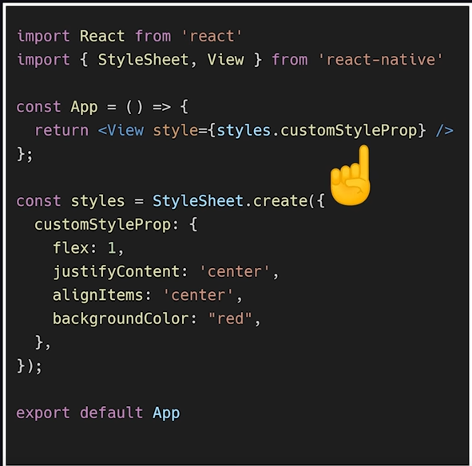

# Facere
## ( Todo in latin )

## Description
Oh no, not another Todo app made for our portfolios. Well to bad. You're getting a todo app.
Not just any Todo app though. We want to make this the most unessecary and fun Todo app.
Keeping practicality in mind? Phf. Please we know you really want to manage your daily tasks through AR/VR. Our app is more of an *experience* so enjoy. 

If you want a basic Todo app there's plenty out there
- Gio ( Master Dev)

---

## Table of Contents 

- [Description](#description)
- [ListOfTechnologies](#ListOfTechnologies)
    -[Environment](#Environment)
    -[Frontend](#Frontend)
    -[Backend](#Backend)
- [Learning resources](#learning-resources-in-order-of-importance)
- [Learning Graphics](#learninggraphics)
- [Installation](#installation)
- [Usage](#usage)
- [Credits](#credits)
- [License](#license)
# [Bottom of page](#tests)
---


- What was your motivation?
    - Our motivation was to learn and develop new skills as a team. For most of us it's our first hackathon.
- Why did you build this project
    - We hope to further our skills, learn TigerGraph technology, and help the world. 
- What problem does it solve?
    - GRAPH FOR BETTER FINANCE
        - Help people or organizations prosper
    - GRAPH FOR BETTER HEALTH
        - Find ways to enable people to live healthier lives.
    - GRAPH FOR BETTER LIVING.
        - Make life more enjoyable for humanity. 


- Problem Solution Summary: 
    - We intend to develop an electron web app that has the capability of monitoring particularly significant aspects of your life, for example, What you do for fun, your browser history, How you spend your money, Where you go and other key metrics that will allow the app to identify users bad-habits and provide useful and relative advice and resources to help themselves break these habits.
    - We wish for this application to be non-discriminatory and non-judgemental in a capacity where it is still capable of providing the advice and resources without offending the user. We intend to build a fruitful application that will be highly-interactive and unique to keep the user engaged and ensure a betterment in their lives. To ensure this frequent and active engagement we have discussed the possibility of an integrated leader-board feature.


- What did you learn?
    - Tbd.

---
# ListOfTechnologies

# Environment
- NodeJS ( API )
- NPM ( Package managment )
- Expo Cli ()
- Andriod/IOS Emulator
# Frontend
- React Native ( Framework )
- Expo ( Framework )
- TypeScript ( programming language)
- Functional Components and hooks ( State managment)
- GraphQL ( Queries )
- React Navigation ( navigate screens)
- Appolo Client ( handle caching / global )
# Backend
---
# Learning resources in order of importance: 
- [Start Devpost](https://www.youtube.com/watch?v=vCa7QFFthfU)
- [Git basics](https://www.youtube.com/watch?v=USjZcfj8yxE)
- [Git hub](https://www.youtube.com/watch?v=nhNq2kIvi9s)
- [Overview of React](https://www.youtube.com/watch?v=Tn6-PIqc4UM)
- [Overview of React Native](https://www.youtube.com/watch?v=gvkqT_Uoahw)
- [How to build our stack](https://www.youtube.com/watch?v=GFQDJlVEXRg)

## Installation

How to get the  *development environment running.* ?

- Step 1: Cry 
- Step 2: clone our repo or copy our amazing code from github
- Step 3: In a terminal, execute this command
            - *npm install* 
- Step 4: This SHOULD install all necessary packages needed from package.json.

### All done! Hopefully... 
---
## Usage

- Step 1: Execute in the terminal 
                *npm start*
It should give an error message asking if you want to install expo globaly. Type Y. 
- Step 2: Redo step 1
- Step 3: Now you should enter a wonderfully confusing CLI for expo. Literally just press w.
            *w*
This should start a web server and open a window for you. If not control + click the port. 

### All done! Hopefully...

    ```md
    
    ```

## Credits

- ### Collaborators
- Giovanni Moscato
    - codingcodewhilegoofin
- Joshua Piecko
    - JP
- ### GitHub profiles
    - [Gios github](https://github.com/codingcodewhilegoofin)
    - [JPs github](https://github.com/Josh-Piecko)
- ### Devpost profiles
    - [Gios devpost](https://devpost.com/codingcodewhilegoofin?ref_content=user-portfolio&ref_feature=portfolio&ref_medium=global-nav)
    - [JPs devpost](https://devpost.com/Josh-Piecko?ref_content=user-portfolio&ref_feature=portfolio&ref_medium=global-nav)
- ### Third-party assets 
---
# [Back to top](#Facere)

# LearningGraphics
React native flow


There is no css only 


Native feature support!

---
## License

MIT License

Copyright (c) 2022 weegee

---


## Badges
🏆


Badges aren't necessary, per se, but they demonstrate street cred. Badges let other developers know that you know what you're doing. Check out the badges hosted by [shields.io](https://shields.io/). You may not understand what they all represent now, but you will in time.

## Features

- None

## How to Contribute

If you created an application or package and would like other developers to contribute it, you can include guidelines for how to do so. The [Contributor Covenant](https://www.contributor-covenant.org/) is an industry standard, but you can always write your own if you'd prefer.

## Tests

Go the extra mile and write tests for your application. Then provide examples on how to run them here.

---
# [Back to top](#Facere)
